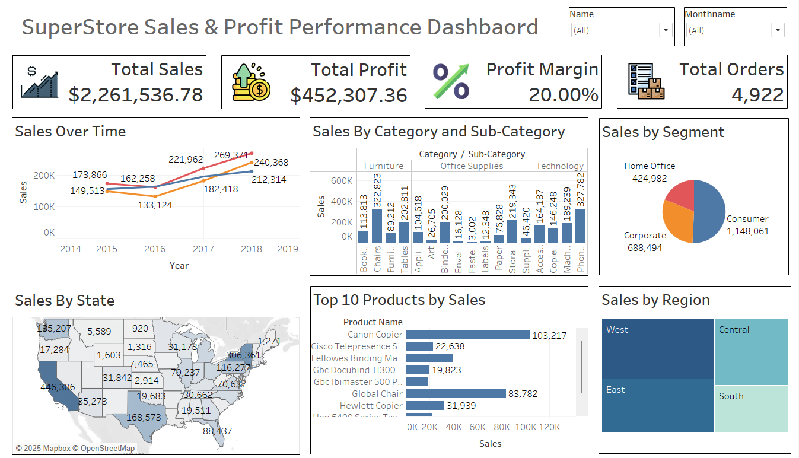

# 📊 Interactive Sales Dashboard (Tableau)

## 📌 Project Overview

The **Interactive Sales Dashboard** is a data visualization project built using **Tableau** to analyze retail sales performance. The dashboard transforms raw sales data into meaningful insights that help understand business trends, customer behavior, and product performance.

This project demonstrates how **data visualization can support data-driven decision making** by highlighting key metrics such as sales growth, profit distribution, regional performance, and product demand.

The dashboard allows users to interact with the data through filters and dynamic visualizations, making it easier to explore patterns and identify opportunities for improvement.

---

## 🎯 Project Objectives

The main goals of this project are:

* Analyze overall **sales and profit performance**
* Identify **top-performing products and categories**
* Understand **regional sales distribution**
* Examine **customer segment behavior**
* Detect **trends in sales over time**
* Build an **interactive dashboard for business insights**

---

## 📊 Dashboard Insights

The dashboard provides several key analytical views:

### 1️⃣ Key Performance Indicators (KPIs)

The dashboard highlights important metrics such as:

* Total Sales
* Total Profit
* Order Count
* Profit Margin

These KPIs help quickly understand the overall business performance.

---

### 2️⃣ Sales Trend Analysis

A time-series visualization shows how sales evolve across months and years.
This helps identify:

* Seasonal sales patterns
* Growth trends
* Sales fluctuations over time

---

### 3️⃣ Category and Sub-Category Performance

The dashboard analyzes product performance by:

* Product Category
* Sub-Category

This helps businesses identify:

* Best selling products
* Low performing categories
* Opportunities for improvement

---

### 4️⃣ Regional Sales Analysis

A geographic visualization highlights sales distribution across different **regions and states**.

This allows stakeholders to understand:

* High revenue regions
* Low performing locations
* Regional market opportunities

---

### 5️⃣ Customer Segment Analysis

The dashboard compares different customer segments such as:

* Consumer
* Corporate
* Home Office

This helps identify which customer groups contribute most to sales and profit.

---

### 6️⃣ Top Performing Products

A ranking visualization highlights the **Top 10 products by sales**, helping businesses focus on their most valuable products.

---

## 🔍 Interactive Features

The dashboard includes interactive filters that allow users to explore the data dynamically.

Users can filter data based on:

* Month
* Customer Name
* Region
* Product Category

This interactivity enables deeper exploration and customized analysis.

---

## 🛠️ Tools and Technologies

| Tool                | Purpose                                   |
| ------------------- | ----------------------------------------- |
| **Tableau**         | Dashboard creation and data visualization |
| **Microsoft Excel** | Data cleaning and preparation             |
| **Kaggle Dataset**  | Source of retail sales dataset            |

---

## 📈 Skills Demonstrated

This project demonstrates the following skills:

* Data Visualization
* Business Data Analysis
* Dashboard Design
* Data Cleaning
* Insight Generation
* Interactive Reporting

---

## 👨‍💻 Author

**Vrushali Mali**
